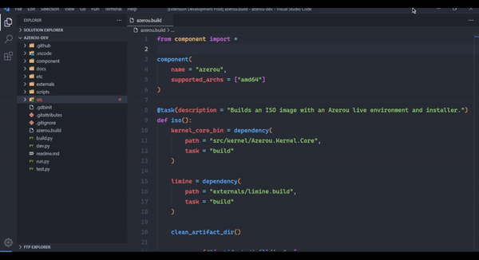

# Path Go To Definition VSCode Extension
Extends the "Go to Definition" (F12) action to support file paths in strings, with extensive customization abilities.

(<a href="https://github.com/ascpixi/vscode-path-go-to-definition"><code>GitHub</code></a> | <a href="https://github.com/ascpixi/vscode-path-go-to-definition/issues"><code>Issue Tracker</code></a>)



## Features

- language-agnostic,
- ability to define regular expressions to match custom path formats in strings,
- ability to define custom settings depending on the language ID of documents and by matching their pathnames via regular expressions.

## Extension Settings

This extension contributes the following settings:

* `pathGoToDefinition.projectRootRegex`: The regex to use when checking for paths that are relative to the project's root directory. Matches the whole string.
* `pathGoToDefinition.relativeRegex`: The regex to use when checking for paths that are relative to the directory the file is in. Matches the whole string.
* `pathGoToDefinition.langWhitelist`: Language IDs that the extension should handle. If empty, all languages are handled.
* `pathGoToDefinition.filenameWhitelist`: If any of the regex patterns in the array match the relative path of a document, the extension will be active for that document. If empty, no checks are performed.
* `pathGoToDefinition.specific`: Allows for specialized configuration sets for different languages or file types.

The `pathGoToDefinition.specific` setting is an array of objects of the given types:
* `language`: The language ID that this specific configuration set matches. (`string` or `null`)
* `path`: The regular expression to match against the file path to determine whether this configuration set applies. (`string` or `null`)
* `projectRootRegex`: The regex to use when checking for paths that are relative to the project's root directory. Matches the whole string. If null or empty, uses the global default. (`string` or `null`)
* `relativeRegex`: The regex to use when checking for paths that are relative to the directory the file is in. Matches the whole string. If null or empty, uses the global default. (`string` or `null`)
* `defaultFile`: If a path points to a directory, the extension will navigate to the file with this name in that directory. (`string` or `null`)
* `assumedProjectRoot`: Paths detected with this configuration set will assume this path as the project root. This path may itself be relative to the real project root.

The defaults for these settings are:

<table>
    <tr>
        <th>Name</th>
        <th>Default</th>
        <th>Default (JSON)</th>
    </tr>
    <tr>
        <td><code>pathGoToDefinition.projectRootRegex</code></td>
        <td><code>^(?:\/|\\).+$</code></td>
        <td><code>"^(?:\\/|\\\\).+$"</code></td>
    </tr>
    <tr>
        <td><code>pathGoToDefinition.relativeRegex</code></td>
        <td><code>^\.(?:\/|\\).+$</code></td>
        <td><code>"^\\.(?:\\/|\\\\).+$"</code></td>
    </tr>
    <tr>
        <td><code>pathGoToDefinition.langWhitelist</code></td>
        <td><code>(empty)</code></td>
        <td><code>[]</code></td>
    </tr>
    <tr>
        <td><code>pathGoToDefinition.filenameWhitelist</code></td>
        <td><code>(empty)</code></td>
        <td><code>[]</code></td>
    </tr>
    <tr>
        <td><code>pathGoToDefinition.specific</code></td>
        <td><code>(empty)</code></td>
        <td><code>[]</code></td>
    </tr>
</table>

The `pathGoToDefinition.specific` can prove useful when defining support for e.g. DSLs based on another language. For example:
```json
{
    "pathGoToDefinition.specific": [
        {
            "language": "python",
            "path": "^.+\\.build$",
            "defaultFile": "component.build",
            "projectRootRegex": "^.+\\/.+$"
        }
    ],
}
```

This snippet will apply to all files that are classified to be Python and that have their pathnames end with `.build`. The project root regex is changed to be less restrictive (only requiring a single slash in a string to be considered a path), and instruct the extension to go to the `component.build` file if the path points to a directory.